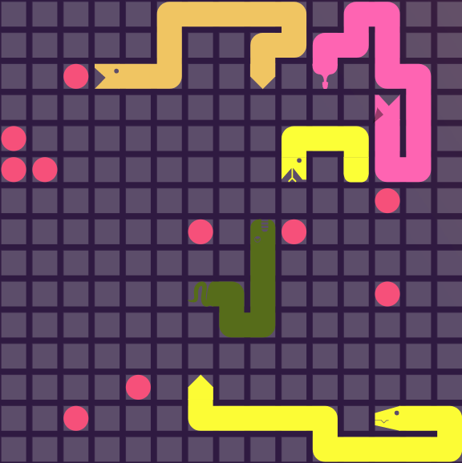
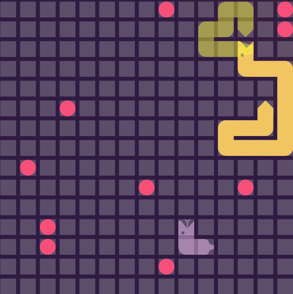
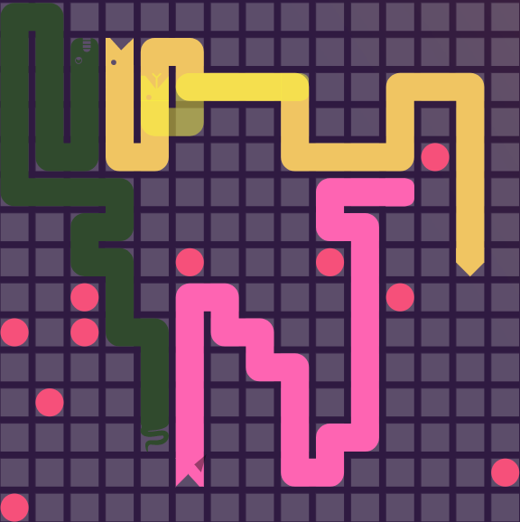

# Table of Contents

-   [Battle Snake 2019](#orgf9ab559)
    -   [Strategy](#org889b147)
        -   [Drawbacks](#orgfb85c54)
    -   [Battle History](#orgcfa9a90)
    -   [Screenshots](#orgc2991ca)
    -   [Usage](#org7bfc615)
        -   [Prerequisites](#orge6d4f36)
        -   [Test Server](#orgf8ef52a)
        -   [Run Locally](#org73d091b)
        -   [Deployment](#org3a27619)
    -   [Acknowledgments](#org4a0f7fb)

# Battle Snake 2019

A simple [BattleSnake](https://www.battlesnake.io) written in Java.
Will be entered in the 2019 Intermediate competition as **Liquid Snake**.

Deployed to `https://battlesnake-liquid.herokuapp.com/`

## Strategy

Our snake's strategy was aggresive. For each turn, if the snake wasn't
the largest on the board, or if the health was below a specific
threshold, the snake would navigate towards the closest food. Otherwise,
it would try to target the other snakes' heads to either eliminate the
opponent in a head-on collision or trap them by cutting off their path.
The snake also included an unused passive state, where she would try to
loop back around to her tail to avoid collisions.

### Drawbacks

The snake's biggest drawback was trapping itself in its own tail. We
didn't implement an effective algorithm to calculate dangerous regions
of the board, and ultimately the snake died by going for takedowns and
boxing itself in.

## Battle History

**Bounty Snakes:**

-   Beat two of [Bambora](https://www.bambora.com/en/ca/)'s bounty snakes
-   Beat [Rooof](https://www.rooof.com/)'s bounty snakes
-   Beat [Giftbit](https://www.giftbit.com/)'s bounty snakes
-   Beat [GitHub](https://github.com)'s two snakes in only 67 moves
-   Beat [Sendwithus](https://www.sendwithus.com/)' three bounty snakes
-   Beat [Semaphore](https://semaphoresolutions.com/)'s zombie snakes and hungry snake
-   Lost to one of [Bambora](https://www.bambora.com/en/ca/)'s bounty snakes
-   Lost to [Accio](https://myaccio.com/)'s defensive snake
-   Lost to [AppColony](http://www.appcolony.ca/)'s tron snake
-   Lost to [Redbrick](https://rdbrck.com/)'s champion snake
-   Lost to [Workday](https://www.workday.com/)'s bounty snake
-   Lost to [CheckFront](https://www.checkfront.com/)'s two bounty snakes

**Tournament:**

The snake came third in both our rounds of the battle. There were 57
competitors in the intermediate tier.  Our games were played on a 15x15 board with 10 food.

Timestamp on [Sendwithus'
Twitch stream](https://www.twitch.tv/videos/234961139) is
[1:56:44-1:58:24](https://www.twitch.tv/videos/234961139?t=01h56m44s).

**[Game 1](https://clips.twitch.tv/SplendidNiceKoalaTwitchRPG)**

**[Game 2](https://clips.twitch.tv/GentleCrispyReubenCorgiDerp)**

## Screenshots

 
 

## Usage

### Prerequisites

1.  Install Heroku
2.  Install Tomcat (To Run Locally)
3.  Install Docker (To Run Test Server)
4.  Install .war Heroku deployment plug-in `heroku plugins:install heroku-cli-deploy`
5.  Create a Heroku App `heroku create <name>`

### Test Server

1.  Run `docker run -it --rm -p 3000:3000 sendwithus/battlesnake-server`
2.  Goto `localhost:3000` in a browser.

### Run Locally

1.  Build .war file `./gradlew build`
2.  Copy .war into `$CATALINA_HOME/webapps`
3.  Start Tomcat using `sudo service tomcat[version] start`
4.  Use `http://[local-ip]:8080` as snake URL.

### Deployment

1.  Build .war file `./gradlew build`
2.  Deploy to Heroku `heroku war:deploy build/libs/BattleSnake-[version].war --app <name>`
3.  Use `https://[name].herokuapp.com/` as snake URL.

## Acknowledgments

-   **Built by** [Ben Austin](https://github.com/austinben),
    [Jaxson Van Doorn](https://github.com/woofers), and
    [Zak White](https://github.com/zakwht), March 3, 2018
-   **Template Forked from**
    [here](https://github.com/tflinz/BasicBattleSnake2018)
-   **Designed for** [Sendwithus](https://github.com/sendwithus)'
    BattleSnake competition, March 3, 2018

