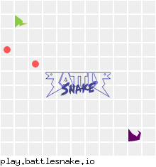

# Table of Contents

-   [Battle Snake 2019](#org181e5d9)
    -   [Strategy](#org55c93dc)
        -   [Drawbacks](#org3e2b02e)
    -   [Battle History](#orgddb4acc)
    -   [Game snippets](#org9c50572)
    -   [Usage](#org018f668)
        -   [Prerequisites](#orga439c20)
        -   [Test Server](#org2d5931e)
        -   [Run Locally](#orgc08c451)
        -   [Deployment](#orgb326486)
    -   [Acknowledgments](#org3232dd1)

# Battle Snake 2019

A simple [BattleSnake](https://www.battlesnake.io) written in Java.

Was entered in the expert divison of 2019's tournament as **🐍 ‏‏‎ 𝙎𝙐𝙋𝙀𝙍 𝙎𝙇𝙄𝙈𝙀𝙔 ‏‏‎ 🐍**.

Deployed to [https://battlesnake-liquid.herokuapp.com/](https://battlesnake-liquid.herokuapp.com/)

## Strategy

Our snake's strategy was aggresive. For each turn, if the snake wasn't
the largest on the board, or if the health was below a specific
threshold, the snake would navigate towards the closest food. Otherwise,
it would try to target the other snakes' heads to either eliminate the
opponent in a head-on collision or trap them by cutting off their path.
The snake also included an unused passive state, where she would try to
loop back around to her tail to avoid collisions.

### Drawbacks

The snake's biggest drawback was trapping itself in its own tail. We
didn't implement an effective algorithm to calculate dangerous regions
of the board, and ultimately the snake died by going for takedowns and
boxing itself in.

## Battle History

**Bounty Snakes:**

-   Beat [Bambora](https://www.bambora.com/en/ca/)'s bounty snakes
-   Beat [Freshworks](https://freshworks.io/)' bounty snakes
-   Beat [Semaphore](https://semaphoresolutions.com/)'s bounty snakes
-   Beat [Workday](https://www.workday.com/)'s bounty snake
-   Beat [Giftbit](https://www.giftbit.com/)'s bounty snakes
-   Beat two of [Rooof](https://www.rooof.com/)'s bounty snakes
-   Beat one of [Redbrick](https://rdbrck.com/)'s bounty snakes
-   Beat one of [Pixel Union](https://www.pixelunion.net/)'s bounty snakes
-   Beat one of [Schneider Electric](https://www.schneider-electric.ca/en/)'s bounty snakes
-   Beat one of [Telmediq](https://www.telmediq.com/)'s bounty snakes
-   Made it to round 6 with [Sendwithus](https://www.sendwithus.com/)' custom bounty snakes
-   Lost to [CheckFront](https://www.checkfront.com/)'s two bounty snakes
-   Lost to [GitHub](https://github.com)'s bounty snake

**Tournament:**

The snake came 4th in the first round of battle, and 2nd in the second round. There were 29
competitors in the expert tier.  Our games were played on a 11x11 board with 5 food spawned at the start.

Timestamp on [Sendwithus'
Twitch stream](https://www.twitch.tv/videos/389395340) is
[2:52:53-2:55:30](https://www.twitch.tv/videos/389395340?t=02h52m53s).

**[Game 1](https://clips.twitch.tv/SoftDepressedWebDAESuppy)**

**[Game 2](https://clips.twitch.tv/CoyRelentlessFiddleheadsSoBayed)**

## Game Snippets

 
 

## Usage

### Prerequisites

1.  Install Java 8 or higher
2.  Install Docker + Docker compose
3.  Install Heroku
4.  Install .war Heroku deployment plug-in `heroku plugins:install heroku-cli-deploy`
5.  Create a Heroku App `heroku create <name>`

### Test Server

1.  Run `docker run -it --rm -p 3000:3000 sendwithus/battlesnake-server`
2.  Goto `localhost:3000` in a browser.

### Run Locally

-   Gradle

    1.  Run the project using either `./gradle run` or `gradlew run` for UNIX and Windows platforms respectively.  This will build and run the project as a \`JAR\` using [Webapp Runner](https://github.com/jsimone/webapp-runner).
    2.  Use `http://localhost:8080` as the snake URL.

-   Docker

    1.  Build the project using either `./gradle build` or `gradlew build` for UNIX and Windows platforms respectively.
    2.  Run the Docker Tomcat image in a container with `docker-compose up`.
    3.  Use `http://localhost:8080/battlesnake` as the snake URL.

### Deployment

1.  Build .war file `./gradlew build`
2.  Deploy to Heroku `heroku war:deploy build/libs/battlesnake.war --app <name>`
3.  Use `https://[name].herokuapp.com/` as the snake URL.

## Acknowledgments

-   **Built by** [Ben Austin](https://github.com/austinben) and
    [Jaxson Van Doorn](https://github.com/woofers), March 2, 2019
-   **Template Forked from**
    [here](https://github.com/tflinz/BasicBattleSnake2018)
-   **Designed for** [Sendwithus](https://github.com/sendwithus)'
    BattleSnake competition, March 2, 2019

