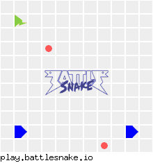
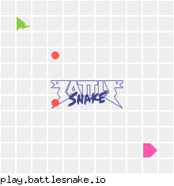
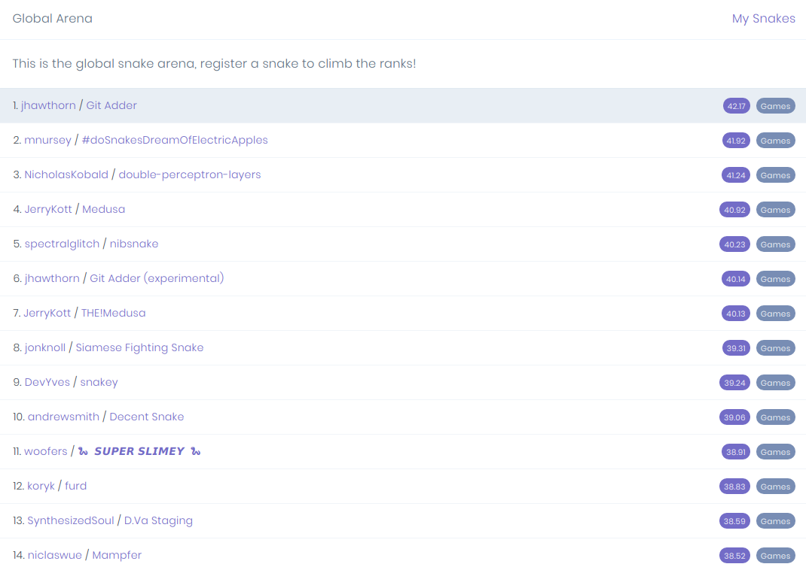

# Battlesnake 2019

A simple [Battlesnake](https://www.battlesnake.io) written in Java.

Was entered in the expert divison of 2019's tournament as 🐍 ‏‏‎ ****𝙎𝙐𝙋𝙀𝙍 𝙎𝙇𝙄𝙈𝙀𝙔**** ‏‏‎ 🐍.

Deployed to [https://battlesnake-liquid.herokuapp.com/](https://battlesnake-liquid.herokuapp.com/)

Battlesnake documentation can be found at <https://docs.battlesnake.io>.

## Strategy

Our snake's strategy was aggresive. For each turn, if the snake wasn't
the largest on the board, or if the health was below a specific
threshold, the snake would navigate towards the closest food. Otherwise,
it would try to target the other snakes' heads to either eliminate the
opponent in a head-on collision or trap them by cutting off their path.

### Drawbacks

Despite efforts to improve the issue from 2018's entry, the snake's biggest
drawback was trapping itself in its own tail. Wedidn't implement an effective
algorithm to calculate dangerous regions of the board, and ultimately the
snake died by going for a food point and boxing itself in.

## Game Snippets

 

## Battle History

**Bounty Snakes**

-   Beat all 3 of [Bambora](https://www.bambora.com/en/ca/)'s bounty snakes
-   Beat all 3 of [Freshworks](https://freshworks.io/)' bounty snake levels
-   Beat both of [Semaphore](https://semaphoresolutions.com/)'s bounty snakes
-   Beat [Workday](https://www.workday.com/)'s bounty snake
-   Beat [Giftbit](https://www.giftbit.com/)'s 3v1 bounty snake match
-   Beat two of four of [Rooof](https://www.rooof.com/)'s bounty snakes
-   Beat one of two of [Redbrick](https://rdbrck.com/)'s bounty snakes
-   Beat both of [Pixel Union](https://www.pixelunion.net/)'s bounty snakes
-   Beat one of [Schneider Electric](https://www.schneider-electric.ca/en/)'s bounty snakes
-   Beat one of [Telmediq](https://www.telmediq.com/)'s bounty snakes
-   Made it to round 6 with [Sendwithus](https://www.sendwithus.com/)' zombie wave style bounty snakes
-   Lost to [CheckFront](https://www.checkfront.com/)'s bounty snake
-   Lost to [GitHub](https://github.com)'s bounty snake

**Tournament**

The snake came 3rd in the first round of battle, and came 2nd in the second round. There were 29
competitors in the expert tier.  Our games were played on a 11x11 board with 5 food spawned at start.

Timestamp on the [Battlesnake.io Twitch stream](https://www.twitch.tv/videos/389395340) is [2:52:53-2:55:30](https://www.twitch.tv/videos/389395340?t=02h52m53s).

**[Game 1](https://clips.twitch.tv/SoftDepressedWebDAESuppy)**

**[Game 2](https://clips.twitch.tv/CoyRelentlessFiddleheadsSoBayed)**

**Arena**

At our highest ranking, shortly after the end of the tournament,
our snake was listed at #11 of ~150 snakes in the **[Arena](https://play.battlesnake.io/leaderboard/)**.
Overall our snake seemed to fluctuate in-between #15-#40.

This ranking is likely somewhat in-accurate as many snakes were
pulled out of the arena for the tournament in-order to minimize load.

## Usage

### Prerequisites

1.  Install JDK 11 or higher
2.  Install Docker + Docker compose (required for [Docker container method](#orgfd68ec6))
3.  Install Heroku CLI (required for [Heroku CLI method](#org8843ce7))
4.  Install .war Heroku deployment plug-in `heroku plugins:install heroku-cli-deploy` ) (required for [Heroku CLI method](#org8843ce7))
5.  Create a Heroku App online or using the Heroku CLI with `heroku create <name>`

    (alternatively any other hosting service can be used)

### Test Board

**Online**

Goto [play.battlesnake.io](https://play.battlesnake.io)

### Run Locally

**Gradle**

1.  Run the project using either `./gradle run` or `gradlew run` for UNIX and Windows platforms respectively.  This will build and run the project as a \`JAR\` using [Webapp Runner](https://github.com/jsimone/webapp-runner).
2.  Use `http://localhost:8080` as the snake URL.

**Docker**

1.  Build the project using either `./gradle build` or `gradlew build` for UNIX and Windows platforms respectively.
2.  Run the Docker Tomcat image in a container with `docker-compose up`.
3.  Use `http://localhost:8080/battlesnake` as the snake URL.

### Deployment

**Heroku-GitHub Integration**

1.  Go the dashboard for the Heroku app.
2.  Click on the `deploy` tab.
3.  Scroll down to the `Deployment method` and select `GitHub`.
4.  Enter the repository name and click `Connect`.

**Heroku CLI**

1.  Build .war file `./gradlew build`
2.  Deploy to Heroku `heroku war:deploy build/libs/battlesnake.war --app <name>`
3.  Use `https://[name].herokuapp.com/` as the snake URL.

## Acknowledgments

-   **Built by** [Ben Austin](https://github.com/austinben) and [Jaxson Van Doorn](https://github.com/woofers)
-   **Adapted from** [tflinz's snake](https://github.com/tflinz/BasicBattleSnake2018)
-   **Designed for** [Battlesnake.io](https://github.com/battlesnakeio) competition

### Training Snakes

Below are some snakes which we found useful for testing our snake with:

-   xtagon/Nagini
-   jonknoll/Siamese Fighting Snake
-   MarkZsombor/Ouroboros
-   koryk/furd
-   tbgiles/FeistySnake
-   gsnake3/Schneider

### Notable Moments

"Is that a Young Thug reference? You guys are awesome."

"Im just a white guy at a coding convention talking about
Young Thug, don't mind me!"

"Ohhh, *you're* woofers. Your emojis are breaking my logs!"

